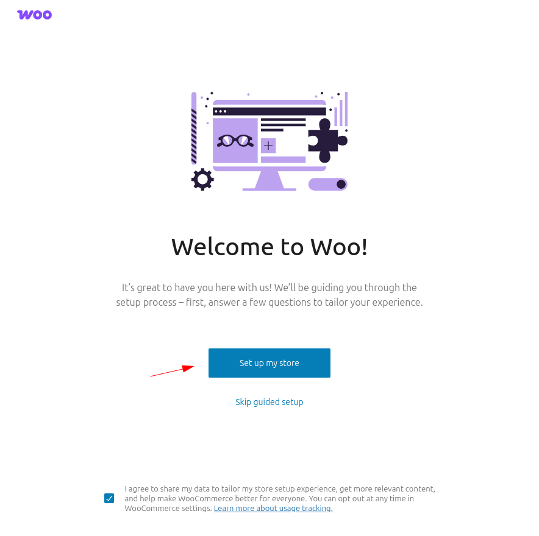
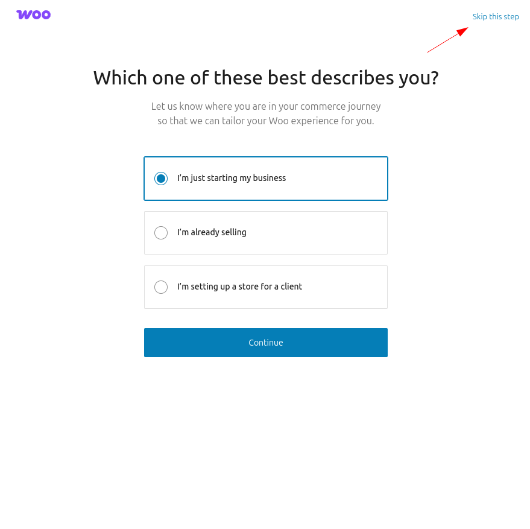
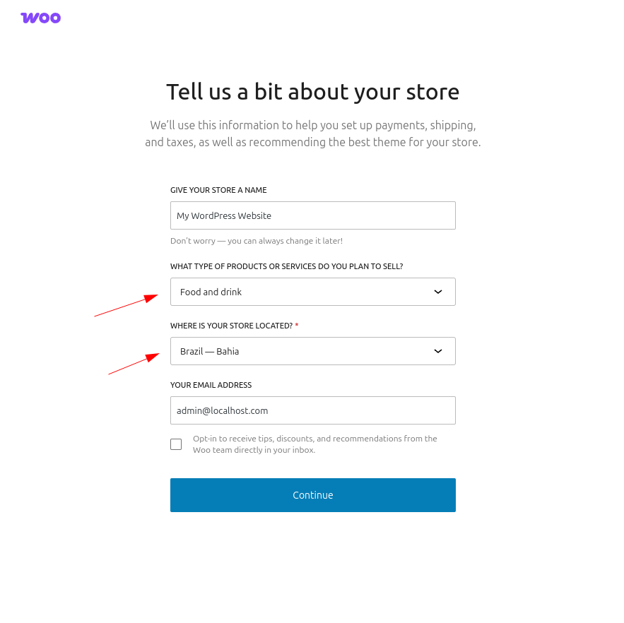
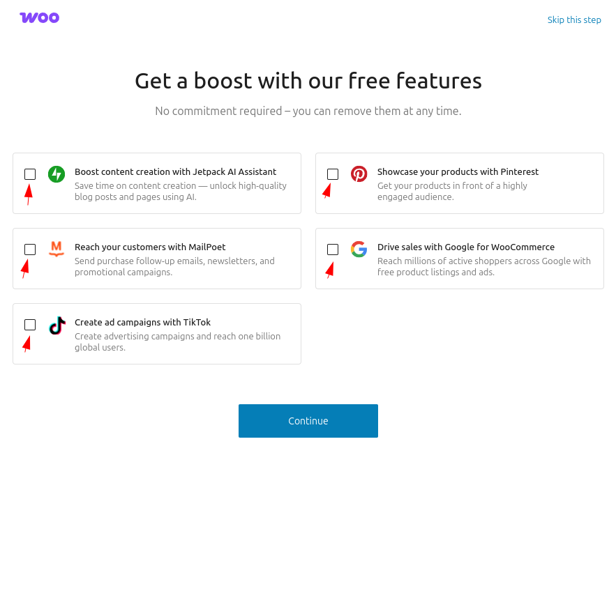
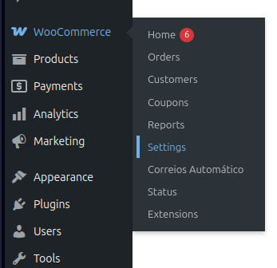
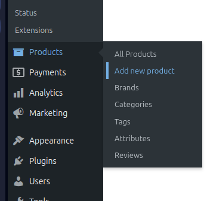
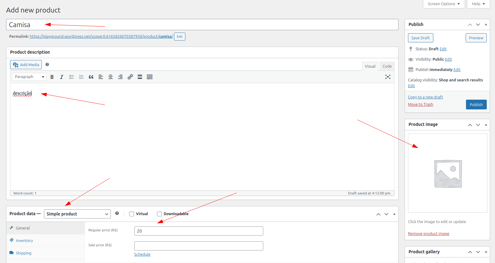
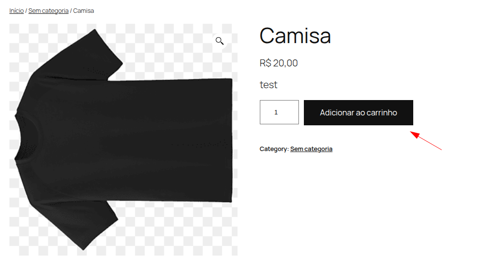
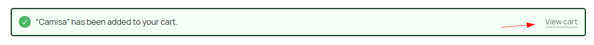

    

# Calculadora de frete melhorada para lojas brasileiras

* Contribuidores: LinkNacional
* Link para doações: [LinkNacional](https://www.linknacional.com.br/)
* Tags: woocommerce, brasil, calculadora de frete, CEP
* Testado até: 6.8
* Requer PHP: 7.3
* Tag estável: 4.1.2
* Licença: GPLv2 ou posterior
* URI da licença: [https://www.gnu.org/licenses/gpl-2.0.html](https://www.gnu.org/licenses/gpl-2.0.html)

## Versão mais recente no Wordpress

## Descrição

Calculadora de frete melhorada para lojas brasileiras:

* Remove os campos de país, estado e cidade.
* Mantém o campo de CEP sempre visível.
* Permite apenas a inserção de números no campo de CEP.
* Exibe um teclado numérico em dispositivos móveis.
* Habilita campo de número de endereço.
* Habilita verificador de cep.
* Desabilita frete no produto.

## Como instalar?

1. Acesse o painel de administração do WordPress e vá para **Plugins > Adicionar Novo**.
2. Pesquise por "Calculadora de frete melhorada para lojas brasileiras".
3. Encontre o plugin, clique em **Instalar Agora** e depois em **Ativar**.
4. Pronto! Nenhuma configuração adicional é necessária.

## Screenshots:

### Página de configuração:

### Antes(shortcode):

### Depois(shortcode):

### Antes(Gutenberg)

### Depois(Gutenberg)

### Novo campo número

**OBS:** Os dados utilizados nas screenshots são meramente ilustrativos.

**Tema utilizado:** Twenty Twenty-Five

## Como configurar o Woo-better no playgroud:

### Certifique-se de configurar os dados iniciais do WooCommerce:

* Clique na opção para iniciar as configurações de preenchimento do Woocommerce:

* Clique em `Skip this step` para prosseguir com a configuração:

* Selecione o tipo de produtos oferecidos no comércio, juntamente com a localização, no caso, Brasil.

* Desmaque todas as opções, pois não iremos utilizar esses recursos na modo de teste:

* Siga para página de Woocommerce -> Settings. Localize o campo de `Postcode(CEP)` e preencha com um CEP de alguma localidade da sua região.

* Salve as configurações.

### Com as configurações inicias finalizada, siga para cadastrar um produto:

* Localize a opção `Products` e selecione `Add new product`:

* Crie um produto simples e preencha seus dados e clique em `Publish`:

### Após o produto e configurações terem sido finalizados, verifique as opções disponíveis do nosso plugin, simplificando e melhorando o preenchimento dos dados no formulário de entrega do Woocommerce(Carrinho/Checkout):

* Para acessar as configurações do nosso plugin acesse `Woocommerce`-> `Settings`:

* Para visualizar o funcionamento completo do nosso plugin deixe a entrega do produto como `padrão` e as demais funcionalidades marcado como `sim`.

* Acesse um produto clicando em `Products`-> `All Products`, então passe o mouse por cima do produto selecionado e clique na opção `View`:

* Clique em `Add to cart` ou `Adicionar ao carrinho`:

* Clique em visualizar o carrinho:

* Na página do carrinho verifique as funcionalidades do nosso plugin nas páginas de `Cart(Carrinho)` e `Checkout`.

* Insira um CEP e verifique as funcionalidades do carrinho, nos quais incluem:

- Validação de CEP.
- Botão de controle, permitindo apenas seguir após inserir um CEP válido.
- Ocultação de campo de endereço.
- Compatibilidade com o modo Legacy e Blocos (Gutenberg).

* Na página de Checkout as funcionalidades são:

- Campo de número(complementando o endereço via `checkbox` ou `text-input`).
- Ocultação de campo de endereço.
- Compatibilidade com o modo Legacy e Blocos (Gutenberg).

## Dicas:

Caso seu carrinho não apresente nenhuma mudança no layout da **Entrega**, tente fazer a seguinte abordagem:

Crie uma página com um novo nome, exemplo: `basic cart` (Carrinho básico), no conteúdo da página insira o **shortcode** do woocommerce referente ao carrinho:

`[woocommerce_cart]`

Você pode também personalizar sua nova página conforme desejar.

Após criar a página, defina a mesma nas configurações do carrinho do `Woocommerce`.

Caminho: **WooCommerce** > **Configurações** > **Avançado** > **Página de instalação**

**Considerações finais**: A partir dessas configurações básicas, seu carrinho personalizado irá carregar durante o processo de pagamento.

## Contato:

Possui dúvidas? Deseja dar um feedback sobre o que achou do plugin ou compartilhar novas ideias? Entre em contato conosco:

[Atendimento LinkNacional](https://www.linknacional.com.br/atendimento/)

