

    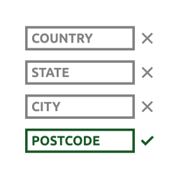

# Calculadora de frete melhorada para lojas brasileiras

* Contribuidores: LinkNacional, luizbills
* Link para doações: [LinkNacional](https://www.linknacional.com.br/)
* Tags: woocommerce, brasil, calculadora de frete, CEP, entrega
* Testado até: 6.8
* Requer PHP: 7.3
* Tag estável: 4.7.0-rc.3
* Licença: GPLv2 ou posterior
* URI da licença: [https://www.gnu.org/licenses/gpl-2.0.html](https://www.gnu.org/licenses/gpl-2.0.html)

## Versão mais recente no Wordpress

## Descrição

Calculadora de frete melhorada para lojas brasileiras, facilitando e melhorando o fluxo de preenchimendo dos dados nas páginas de carrinho e checkout:

> Na página de Carrinho:

- Validação de CEP.
- Controle no botão de envio, permitindo apenas seguir após inserir um CEP válido.
- Ocultação de campos de endereço.
- Compatibilidade com o modo Legacy e Blocos (Gutenberg).

> Na página de Checkout:

- Campo de número(complementando o endereço via `checkbox` ou `text-input`).
- Ocultação de campos de endereço.
- Compatibilidade com o modo Legacy e Blocos (Gutenberg).

> Funcionalidades Adicionais:

- Opção para definir um valor mínimo no carrinho para frete grátis.
- Totalmente personalizável através das configurações do plugin.

## Como instalar?

1. Acesse o painel de administração do WordPress e vá para **Plugins > Adicionar Novo**.
2. Pesquise por "Calculadora de frete melhorada para lojas brasileiras".
3. Encontre o plugin, clique em **Instalar Agora** e depois em **Ativar**.
4. Pronto! Nenhuma configuração adicional é necessária.

## Screenshots:

### Página de configuração:
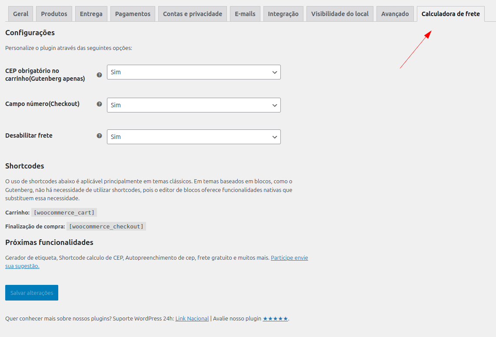

### Antes(shortcode):

### Depois(shortcode):

### Antes(Gutenberg)
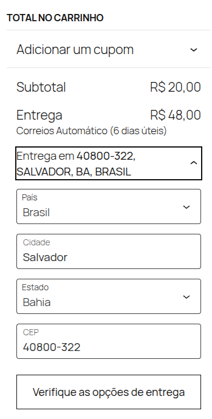

### Depois(Gutenberg)
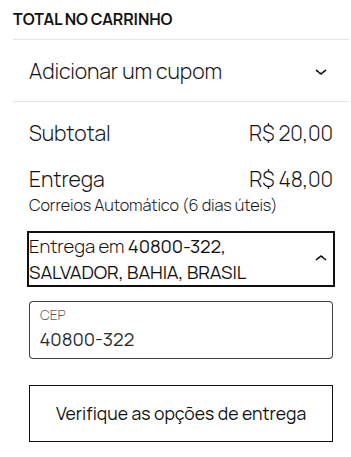

### Novo campo número
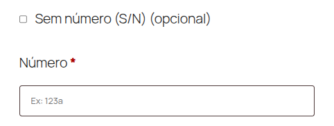

### Barra de progresso em Legacy(Cart / Checkout):

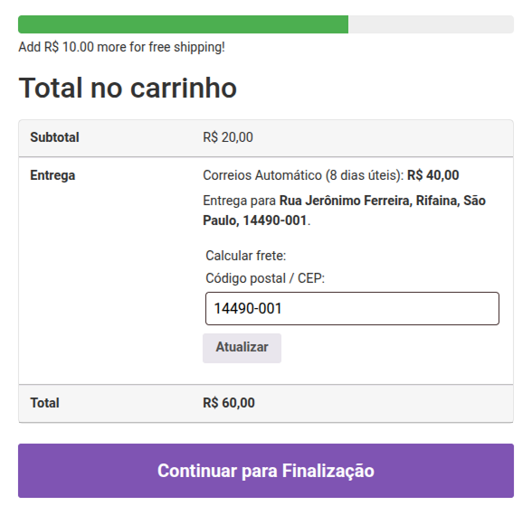

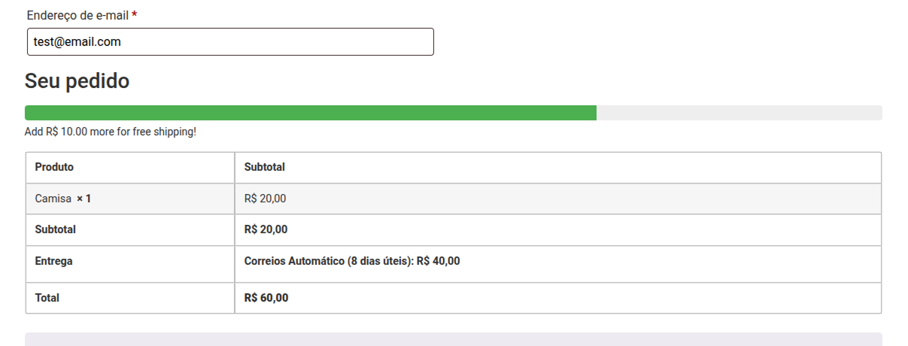

### Barra de progresso em Gutenberg(Cart / Checkout):

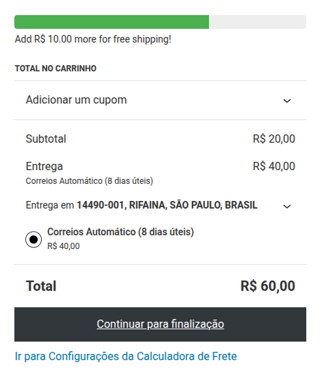

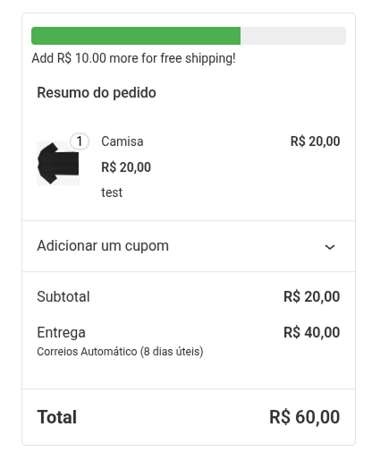

**OBS:** Os dados utilizados nas screenshots são meramente ilustrativos.

**Tema utilizado:** Twenty Twenty-Five

## Dicas:

Caso seu carrinho não apresente nenhuma mudança no layout da **Entrega**, tente fazer a seguinte abordagem:

Crie uma página com um novo nome, exemplo: `basic cart` (Carrinho básico), no conteúdo da página insira o **shortcode** do woocommerce referente ao carrinho:

`[woocommerce_cart]`

Você pode também personalizar sua nova página conforme desejar.

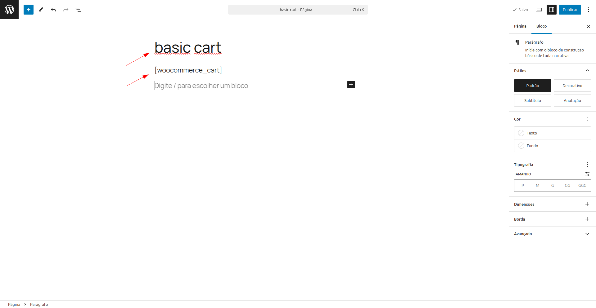

Após criar a página, defina a mesma nas configurações do carrinho do `Woocommerce`.

Caminho: **WooCommerce** > **Configurações** > **Avançado** > **Página de instalação**

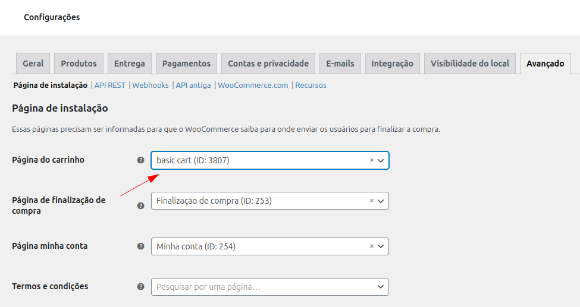

**Considerações finais**: A partir dessas configurações básicas, seu carrinho personalizado irá carregar durante o processo de pagamento.

## Contato:

Possui dúvidas? Deseja dar um feedback sobre o que achou do plugin ou compartilhar novas ideias? Entre em contato conosco:

[Atendimento LinkNacional](https://www.linknacional.com.br/atendimento/)

