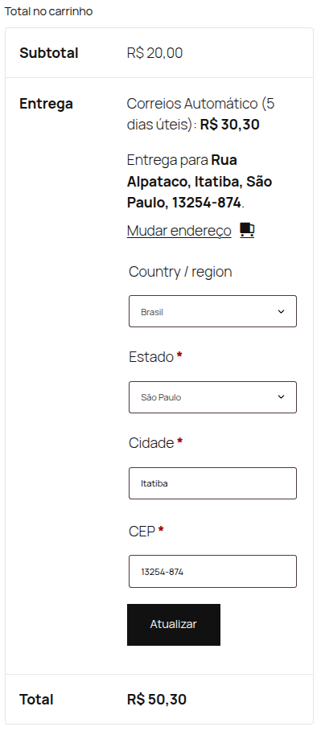
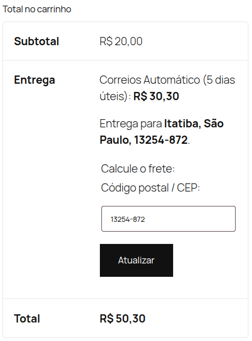

    

# Calculadora de frete melhorada para lojas brasileiras

* Contribuidores: LinkNacional
* Link para doações: [LinkNacional](https://www.linknacional.com.br/)
* Tags: woocommerce, brasil, calculadora de frete, CEP
* Testado até: 6.7
* Requer PHP: 7.3
* Tag estável: 4.0.0
* Licença: GPLv2 ou posterior
* URI da licença: [https://www.gnu.org/licenses/gpl-2.0.html](https://www.gnu.org/licenses/gpl-2.0.html)

## Versão mais recente no Wordpress

## Descrição

Calculadora de frete do WooCommerce otimizada para lojas brasileiras:

* Remove os campos de país, estado e cidade.
* Mantém o campo de CEP sempre visível.
* Permite apenas a inserção de números no campo de CEP.
* Exibe um teclado numérico em dispositivos móveis.

## Como instalar?

1. Acesse o painel de administração do WordPress e vá para **Plugins > Adicionar Novo**.
2. Pesquise por "Calculadora de Frete Aprimorada para Lojas Brasileiras".
3. Encontre o plugin, clique em **Instalar Agora** e depois em **Ativar**.
4. Pronto! Nenhuma configuração adicional é necessária.

## Screenshots:

### ANTES:

### DEPOIS:

**OBS:** Os dados utilizados nas screenshots são meramente ilustrativos.

**Tema utilizado:** Twenty Twenty-Five

## Dicas:

Caso seu carrinho não apresente nenhuma mudança no layout da **Entrega**, tente fazer a seguinte abordagem:

Crie uma página com um novo nome, exemplo: `basic cart` (Carrinho básico), no conteúdo da página insira o **shortcode** do woocommerce referente ao carrinho:

`[woocommerce_cart]`

Você pode também personalizar sua nova página conforme desejar.

Após criar a seguida, defina a mesma nas configurações do carrinho do `Woocommerce`.

Caminho: **WooCommerce** > **Configurações** > **Avançado** > **Página de instalação**

**Considerações finais**: A partir dessas configurações básicas, seu carrinho personalizado irá carregar durante o processo de pagamento. Lembre-se de que, nas próximas atualizações, esse problema deixará de existir.

## Contato:

Possui dúvidas? Deseja dar um feedback sobre o que achou do plugin ou compartilhar novas ideias? Envie um e-mail para nosso contato:

E-mail: contato@linknacional.com

