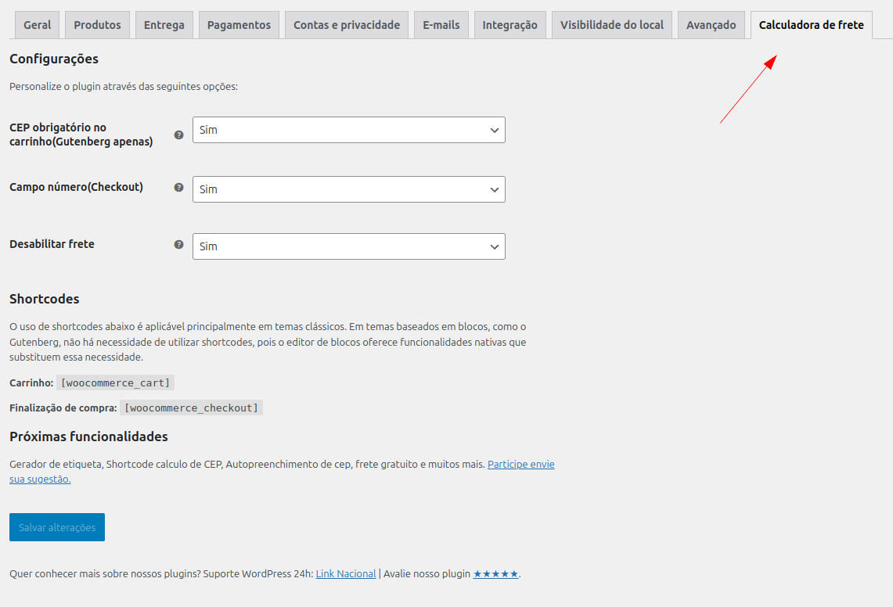
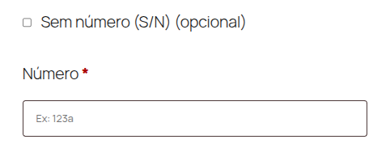

    

# Fields for Brazilian Checkout for WooCommerce

* Contribuidores: LinkNacional, luizbills
* Link para doações: [LinkNacional](https://www.linknacional.com.br/)
* Tags: woocommerce, checkout, CPF, CNPJ, CEP
* Testado até: 7.1
* Requer PHP: 8.2
* Tag estável: 5.0.0
* Licença: GPLv2 ou posterior
* URI da licença: [https://www.gnu.org/licenses/gpl-2.0.html](https://www.gnu.org/licenses/gpl-2.0.html)

## Versão mais recente no Wordpress

## Descrição

Plugin de **campos brasileiros para o checkout do WooCommerce**, facilitando e melhorando o fluxo de preenchimento dos dados nas páginas de checkout.

> Campos de Checkout:

- CPF e CNPJ com validação automática (incluindo CNPJ alfanumérico).
- Campo de número do endereço (com checkbox "Sem número").
- Campo de bairro.
- Telefone com máscara e DDI.
- Seletor de Pessoa Física / Pessoa Jurídica.
- Inscrição Estadual (IE).
- Data de nascimento e gênero.
- Preenchimento automático do endereço pelo CEP.
- Compatibilidade com o modo Legacy e Blocos (Gutenberg).

> **Nota:** A calculadora de frete (página de produto e carrinho) migrou para o plugin [Shipping Simulator for WooCommerce](https://wordpress.org/plugins/shipping-simulator-for-woocommerce/).

## Como instalar?

1. Acesse o painel de administração do WordPress e vá para **Plugins > Adicionar Novo**.
2. Pesquise por "Fields for Brazilian Checkout for WooCommerce".
3. Encontre o plugin, clique em **Instalar Agora** e depois em **Ativar**.
4. Pronto! Nenhuma configuração adicional é necessária.

## Screenshots:

### Página de configuração:

### Campo número (shortcode):

### Campo número (Gutenberg):

**OBS:** Os dados utilizados nas screenshots são meramente ilustrativos.

## Contato:

Possui dúvidas? Deseja dar um feedback sobre o que achou do plugin ou compartilhar novas ideias? Entre em contato conosco:

[Atendimento LinkNacional](https://www.linknacional.com.br/atendimento/)
